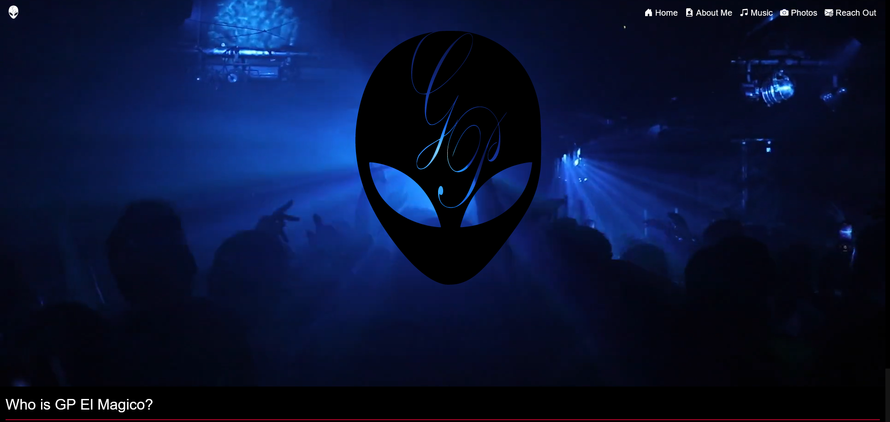
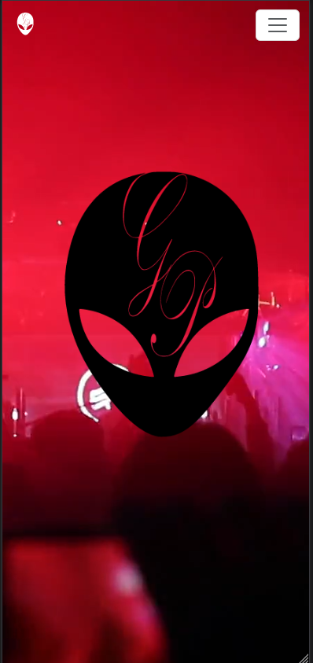

# GP Portfolio

A front-end application for Milwaukee artist, GP El Magico, to showcase his talent as a Latino rapper.

## Usage

[Click here to check out the live site!](https://gp-elmagico.netlify.app/)

### Screenshots

#### Desktop View

#### Mobile View

  

## Credits

this app uses the folowing technologies:

* HMTL

* CSS

* JavaScript

* [Bootstrap](https://getbootstrap.com/) : components

* [Bootstrap Icons](https://icons.getbootstrap.com/) : fonts

* [Font awesome](https://fontawesome.com/) : fonts

* [Youtube](https://www.youtube.com/) : embeded video

* [SoundCloud](https://developers.soundcloud.com/) : embedded playlist

* [EmailJS](https://www.emailjs.com/) : message forwarding

* [Pexels](https://www.pexels.com/) : media

* [InkScape](https://inkscape.org/) : logos

## Contribute
  
if you would like to contribute to this project contact me through:

* [E-mail](mailto:marquez.jay444@gmail.com)
* [GitHub](https://www.github.com/Jay-MM)
